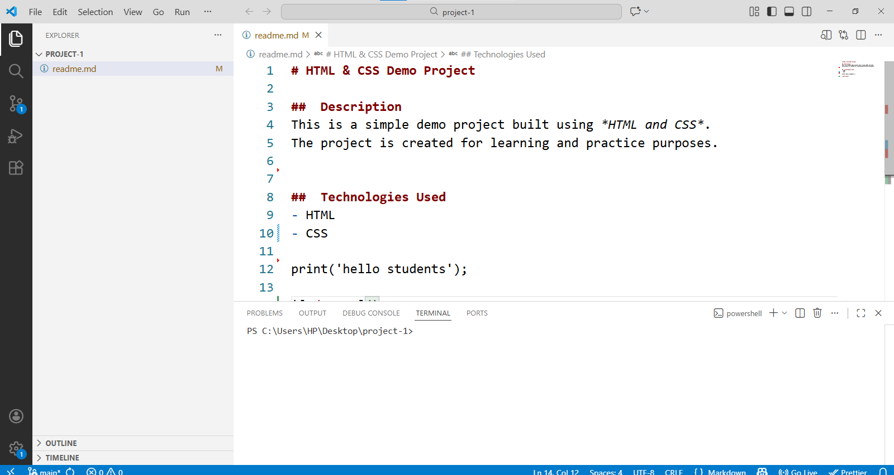

# HTML & CSS Demo Project

##  Description
This is a simple demo project built using *HTML and CSS*.  
The project is created for learning and practice purposes.

##  Technologies Used
- HTML
- CSS 

print('hello students'); 

 

